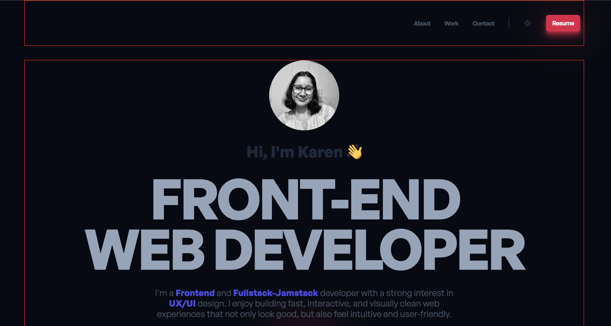

# 🌐 Build Portfolio Website

This portfolio website is composed of **7 sections**:
1. Header  
2. Hero  
3. About  
4. Featured Project  
5. More Projects  
6. Contact  
7. Footer  

It was developed by following a tutorial and served as practice to improve my skills in creating a structured and visually appealing portfolio website.

🎥 Demo del proyecto en YouTube: [Build Portfolio Website](https://www.youtube.com/watch?v=dLDn_k8GmaU)

##  🔸 Screenshot 


## 🔸 How to use
If this is your first time cloning the repository:
```bash
npm i
```

If you already have the dependencies installed:
```bash
cd build-portfolio-webside
```

```bash
npm run dev
```
(the page must be running)
